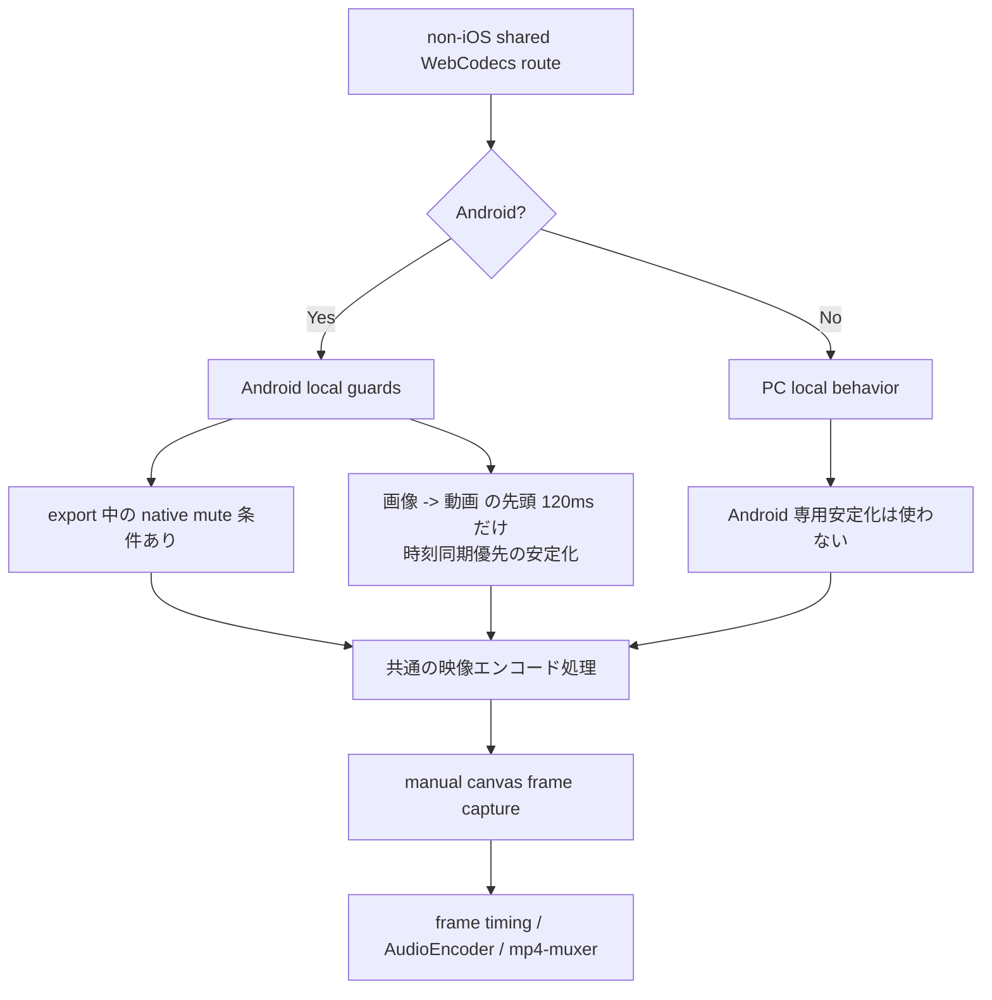

# PC / Android / iOS 分岐図

現在の実装で、PC / Android / iOS Safari がどこで共通化され、どこで分岐しているかを図解したメモです。

対象は主に動画エクスポート経路です。プレビューや保存でも一部 platform 条件はありますが、ここでは「書き出しの大ルート」と「非 iOS 共通ルート内の局所分岐」に絞って整理します。

## 1. エクスポート戦略の大ルート

```mermaid
flowchart TD
    A[export 開始<br/>useExport.ts] --> B[getPlatformCapabilities]
    B --> C{isIosSafari かつ<br/>MP4 MediaRecorder 対応?}
    C -- Yes --> D[iOS Safari MediaRecorder strategy<br/>iosSafariMediaRecorder.ts]
    C -- No --> H[shared WebCodecs MP4 route]

    D --> E{MediaRecorder strategy 成功?}
    E -- Yes --> F[export 完了]
    E -- No --> H

    H --> I{音声ソースあり?}
    I -- Yes --> J[OfflineAudioContext で<br/>音声を先行プリレンダリング]
    I -- No --> K{live audio track あり かつ<br/>non-iOS かつ TrackProcessor 対応?}

    J --> L[pre-rendered audio を使用]
    J -. 失敗時 .-> K
    K -- Yes --> M[TrackProcessor capture]
    K -- No --> N[ScriptProcessor fallback<br/>または無音経路]

    L --> O[VideoFrame(canvas) + AudioEncoder<br/>+ mp4-muxer]
    M --> O
    N --> O
    O --> F
```

### 要点

- `iOS Safari` だけが `ios-safari-mediarecorder` を優先します。
- `PC / Android` は同じ `webcodecs-mp4` ルートに入ります。
- ただし、同じ非 iOS ルート内でも Android 向けの局所分岐は存在します。

## 2. 非 iOS 共通ルート内の局所分岐



### 要点

- `PC` と `Android` は大ルートは同じです。
- 違いは「Android のみ必要な局所ガードが一部ある」点です。
- 今回の修正で、`画像 -> 動画` 境界の安定化は Android のみに限定し、PC 非 iOS export には掛からないようにしています。

## 3. 一覧表

| 項目 | PC | Android | iOS Safari |
| --- | --- | --- | --- |
| export 戦略の入口 | `webcodecs-mp4` | `webcodecs-mp4` | `ios-safari-mediarecorder` 優先 |
| MediaRecorder 優先経路 | なし | なし | あり |
| `画像 -> 動画` 境界の Android 専用安定化 | なし | あり | なし |
| export 中の native mute 条件 | なし | あり | あり |
| `audioContextMayInterrupt` 前提 | なし | なし | あり |

## 4. 主なコード上の責務

- `src/utils/platform.ts`
  - platform capability 判定
- `src/hooks/export-strategies/exportStrategyResolver.ts`
  - export 戦略順序と音声 capture 戦略の決定
- `src/hooks/export-strategies/iosSafariMediaRecorder.ts`
  - iOS Safari 専用 MediaRecorder 経路
- `src/hooks/useExport.ts`
  - export 本体のオーケストレーション
- `src/utils/previewPlatform.ts`
  - Android / iOS Safari の局所ガード判定
- `src/components/TurtleVideo.tsx`
  - render loop と media element の同期制御

## 5. 補足

- `PC` と `Android` は「別製品レベルで別ルート」ではなく、同じ非 iOS ルートの中で一部だけ条件分岐しています。
- `iOS Safari` は音声経路と MediaRecorder 都合が大きく異なるため、戦略レベルで明確に分けています。
